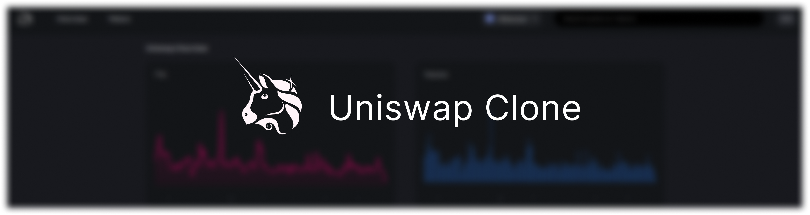
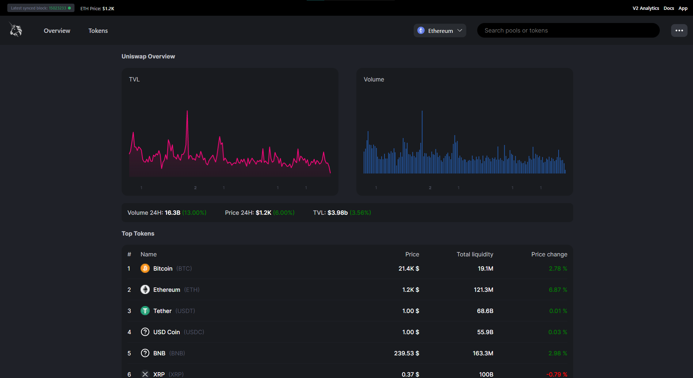

# 🦄 Uniswap clone



## Front-end project using a third-party API with Next.js

## ✏️ Description

**Uniswap Clone** is a reproduction of the famous Uniswap exchange app build with the [Uniswap v2](https://uniswap.org/) protocol.
I have build this app using [Next](https://nextjs.org/) framework, [CoinMarketCap](https://coinmarketcap.com/) **API** and **Web3** [Alchemy](https://www.alchemy.com/) library. <br/>
Based Ethereum App. Possibility to track price, volume and TVL of top 100 listed cryptocurrencies (Stablecoins / Decentralized Currency). <br/>
In the future, I will add a web3 **Trading** system to the app based on the Ethereum protocol with Solidity.
Fully responsive application. <br/>
Upload with Vercel.

## ⚡️ Overview



## 🔥 Experience

This project helped me to learn how to use the coinmarketcap API and how to build a complex application using Next.js (implementation of **Context API** and custom **Hooks**).

## ⚙️ Techno used

   

## 🔧 Install

```
git clone https://github.com/Greepsu/uniswap-clone
cd uniswap-clone
npm start
```

## 💻 Links

Application: https://uniswap-clone-omega.vercel.app <br/>
Github: https://github.com/Greepsu/uniswap-clone
